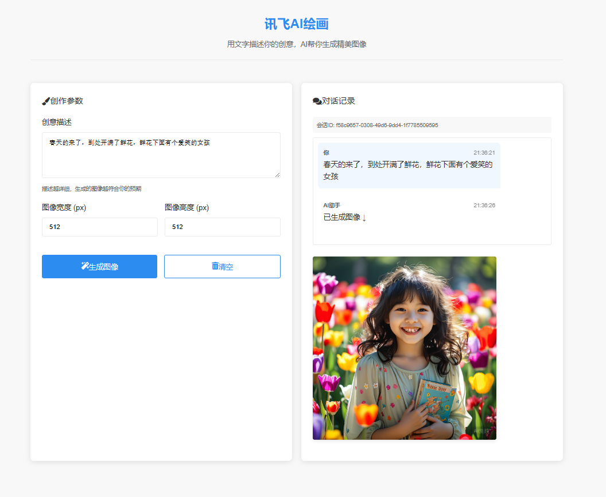
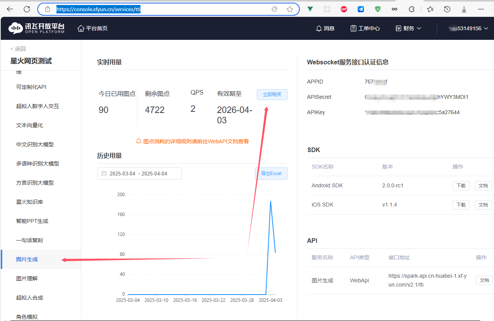

# 讯飞AI文字图像生成

## 项目简介

讯飞AI绘画是一个基于讯飞开放平台AI能力的创意图像生成工具。用户只需通过文字描述自己的创意，AI即可帮助生成精美的图像。该项目包含完整的前端界面和后端服务，实现了创意描述、图像生成、对话记录等功能。



## 功能特性

- 🎨 文字描述生成图像
- 📝 创意描述输入与参数设置
- 💬 完整的对话记录功能
- 📱 响应式设计，适配不同设备
- 🔄 会话持久化，支持历史记录查看

## 技术栈

### 前端

- HTML5 & CSS3
- JavaScript (ES6+)
- 响应式布局
- 现代CSS (Grid, Flexbox, CSS Variables)

### 后端

- Node.js
- Express.js
- Axios (HTTP客户端)
- 讯飞开放平台API

## 快速开始

### 前提条件

- Node.js (v16+)
- 讯飞开放平台创建应用申请免费token获取API密钥等信息
  - [控制台-讯飞开放平台](https://console.xfyun.cn/services/tti)
  - 

### 安装步骤

1. 克隆仓库：

   ```
   git clone https://github.com/zou-hong-run/xinghuo_image.git
   cd xinghuo_image
   ```

2. 安装依赖：

   ```
   npm install
   ```

3. 配置环境变量：
   创建 `.env` 文件并添加以下内容：

   ```
   XF_APP_ID=你的讯飞APP_ID
   XF_API_KEY=你的讯飞API_KEY
   XF_API_SECRET=你的讯飞API_SECRET
   PORT=3000
   ```

4. 启动开发服务器：

   ```
   npm run dev
   ```

5. 访问应用：
   打开浏览器访问 `http://localhost:3000`
   
6. 

## 项目结构

```
xinghuo_image/
├── public/                # 前端静态文件
│   ├── index.html         # 主页面
│   └── styles/           # CSS文件
├── index.js              # 后端主文件
├── package.json          # 项目配置
└── README.md             # 项目文档
```

## 配置说明

### 环境变量

| 变量名        | 描述                   | 必填          |
| :------------ | :--------------------- | :------------ |
| XF_APP_ID     | 讯飞开放平台APP ID     | 是            |
| XF_API_KEY    | 讯飞开放平台API Key    | 是            |
| XF_API_SECRET | 讯飞开放平台API Secret | 是            |
| PORT          | 服务器端口             | 否 (默认3000) |

## 使用指南

1. 在创意描述框中输入您想要生成的图像内容
2. 设置图像宽度和高度 (默认512x512)
3. 点击"生成图像"按钮
4. 等待AI处理并显示结果
5. 对话记录会自动保存，您可以随时查看历史记录

## 贡献指南

欢迎贡献！请遵循以下步骤：

1. Fork项目
2. 创建您的特性分支 (`git checkout -b feature/AmazingFeature`)
3. 提交您的更改 (`git commit -m 'Add some AmazingFeature'`)
4. 推送到分支 (`git push origin feature/AmazingFeature`)
5. 打开Pull Request

## 许可证

本项目采用 [MIT License](https://license/)。

## 致谢

- 讯飞开放平台提供的AI能力
- 所有贡献者和用户

## 联系方式

如有任何问题或建议，请联系项目维护者：

- 邮箱: zhr19853149156@163.com
- GitHub: [zou-hong-run/xinghuo_image](https://github.com/zou-hong-run/xinghuo_image)

## 公众号

已经接入ai，可以找他聊天，没事更点技术文章

[zou-hong-run/wechat-ai-spark: 微信公众号接入AI讯飞星火认知大模型（express+websocket）](https://github.com/zou-hong-run/wechat-ai-spark)


## 赞助

您的支持是我最大的更新动力


